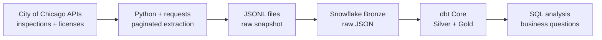
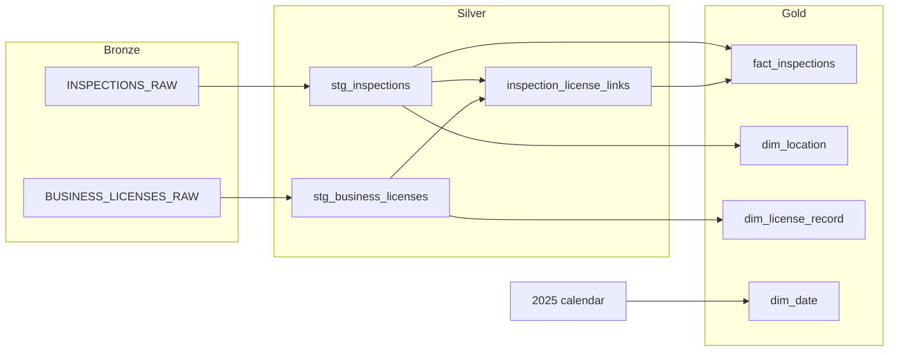
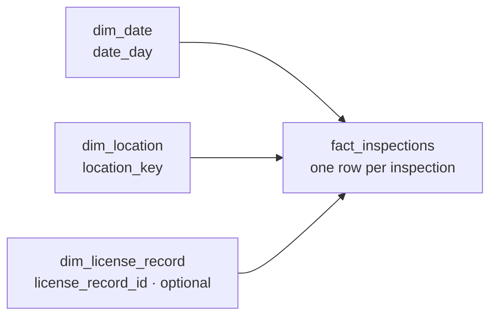

# Chicago Restaurant Inspections Warehouse

An ELT project that combines 2025 Chicago restaurant inspections with business license records. Python extracts data from two public APIs, Snowflake stores the raw JSON, and dbt builds a warehouse for SQL analysis.

## Project workflow



The snapshot downloaded on September 25, 2026 contains **13,864 inspections** and **17,830 license records**. Later downloads may differ because the source datasets are updated.

## dbt model flow

The diagram below shows which models dbt builds from each source. Staging converts JSON fields into typed columns; the Silver link model selects a license record for each inspection; Gold contains the analysis tables.



## Gold warehouse

`fact_inspections` has **one row per inspection**. Its keys connect each result to a date and an inspection location. A license-record key is present only when a date-covered match exists.



| Gold table | Grain | Useful fields |
| --- | --- | --- |
| `fact_inspections` | One row per inspection | Result, risk, inspection type, dimension keys |
| `dim_date` | One row per 2025 calendar day | Month, quarter, weekday |
| `dim_location` | One row per distinct inspection location | Address, city, ZIP |
| `dim_license_record` | One row per license record | Business name, license number, license dates |

One license number can have multiple records. The matching rule selects the record with the **latest start date among records that cover the inspection date**. It preserves inspections without a match: **11,303 matched** and **2,561 unmatched** in this snapshot. A date-covered record does not prove the license's exact status on the inspection date; status fields can change later.

## Questions answered

The SQL queries are saved in [`sql/03_analysis.sql`](sql/03_analysis.sql).

1. **How did inspections and `Fail` results change by month?** The 2025 data has **2,423** `Fail` results across **13,864** inspections.
2. **Which ZIP codes had the most `Fail` results?** ZIP **60622** had **148** `Fail` results among **597** inspections.
3. **Which matched businesses had repeated `Fail` results?** Grand Rising Cafe had **6** `Fail` results among **8** inspections.
4. **How are inspection results distributed across risk categories?** `Risk 1 (High)` had **2,069** `Fail` results in the snapshot.
5. **Which inspection types had the most `Fail` results?** `Canvass` had **1,385** `Fail` results.

These are counts from one snapshot, not failure rates or explanations for why an inspection failed. The business query excludes inspections without a matching license record.

## Data sources

- [Food Inspections](https://data.cityofchicago.org/Health-Human-Services/Food-Inspections/4ijn-s7e5): filtered to `facility_type = 'Restaurant'` and 2025 inspection dates.
- [Business Licenses](https://data.cityofchicago.org/Community-Economic-Development/Business-Licenses/r5kz-chrr): filtered to `Retail Food Establishment` license records whose date ranges overlap 2025.

## Reproduce the project

The commands use PowerShell from the project root. Loading the JSONL files into Snowflake is currently a manual step in Snowsight.

1. Create the environment and extract the API data:

   ```powershell
   python -m venv .venv
   .\.venv\Scripts\Activate.ps1
   python -m pip install -r requirements.txt
   python src/extract.py
   ```

   The requirements include `pandas` and `ipykernel` for the exploration notebook.

2. In Snowflake, run [`sql/01_setup.sql`](sql/01_setup.sql) and [`sql/02_bronze_tables.sql`](sql/02_bronze_tables.sql). Load `data/raw/inspections_2025.jsonl` into `BRONZE.INSPECTIONS_RAW` and `data/raw/business_licenses_2025_overlap.jsonl` into `BRONZE.BUSINESS_LICENSES_RAW` as JSON.
3. Configure a local dbt profile named `chicago_restaurant_inspections` with access to `CHICAGO_RESTAURANT_DB` and `CHICAGO_WH`. Keep Snowflake credentials outside the repository.
4. Build and test the models:

   ```powershell
   cd dbt
   dbt debug
   dbt run
   dbt test
   ```

5. Run [`sql/03_analysis.sql`](sql/03_analysis.sql) in Snowflake.

The current dbt target creates `DBT_DEV_SILVER` and `DBT_DEV_GOLD`. If the target schema changes, update the schema names in the analysis queries.

## Repository map

- [`src/extract.py`](src/extract.py) — paginated API extraction and JSONL snapshot.
- [`notebooks/01_explore_inspections.ipynb`](notebooks/01_explore_inspections.ipynb) — data exploration and investigation of the matching rule.
- [`sql/`](sql/) — Snowflake setup and analysis queries.
- [`dbt/models/`](dbt/models/) — staging, Silver, and Gold models.
- [`dbt/tests/`](dbt/tests/) — additional data-quality check.
- [`requirements.txt`](requirements.txt) — Python package versions used for the project.
